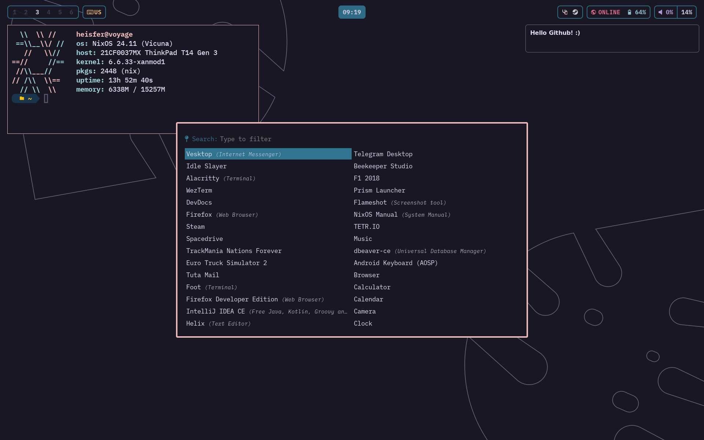

> [!WARNING]  
> Removing Home-manager and moving to nixos/hjem based system. Below README is out-of-date.

# My NixOS Configuration
This flakes configuration is built with `flake-parts`. Currently it's only supporting single hosts.

## Directory Structure
| Location | Description |
| --- | --- |
| [Root](./)
| [Lib](./lib) | Extended nixpkgs lib and extra |
| [Userspace](./userspace) | Home directory configurations. |
| `nixos` | NixOS Configurations & Modules |
| |
| [Pkgs](./pkgs) | Custom Packages |
* overlays are not used

## Made with

* Testing :) It works!
* Helix
  * Post modern editor
* nixfmt-rfc-style
  * Formatting nix code
* deadnix
  * Scans files for dead code 
* wezterm
  * Default terminal

## Screenshot

